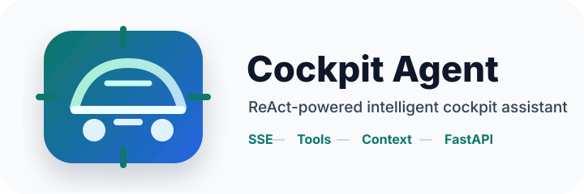
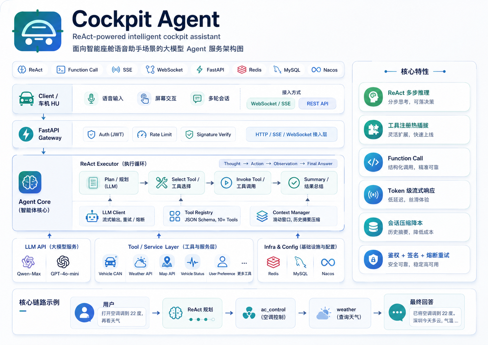

<p align="center">
  
</p>

<p align="center">
  <a href="#"></a>
  <a href="#"></a>
  <a href="#"></a>
  <a href="#"></a>
</p>

<p align="center">
  Intelligent cockpit assistant service with ReAct orchestration, streaming responses, tool calling, and session context management.
</p>

## Overview

Cockpit Agent is a FastAPI-based service for vehicle cockpit assistant scenarios. It turns natural language requests into multi-step actions such as climate control, vehicle status lookup, weather search, navigation planning, preference storage, and media control.

The project ships with a local heuristic LLM fallback, so the full request path can be explored without configuring an external model. When an OpenAI-compatible endpoint is configured, the same runtime uses streaming model responses.

## Features

- **ReAct execution loop**: `Thought -> Action -> Observation -> Final Answer`
- **SSE streaming**: token and intermediate tool events over `text/event-stream`
- **Tool registry**: Pydantic schema validation, async dispatch, timeout handling, enable/disable switches
- **Cockpit tools**: AC, seats, windows, vehicle status, weather, navigation, preferences, vehicle QA, music
- **Context management**: memory or Redis-backed sessions with summary compression and recent-message retention
- **Security hooks**: optional JWT verification and HMAC request signature checks
- **Model adapter**: OpenAI-compatible streaming client plus local fallback for development and tests
- **Deployable shape**: Dockerfile, Compose file, docs, and test suite included

## Architecture

<p align="center">
  
</p>

The runtime is organized around a FastAPI gateway, a ReAct executor, a schema-driven tool registry, streaming model adapters, and a context manager that keeps long conversations compact.

## Quick Start

```bash
pip install -e ".[dev]"
uvicorn app.main:app --reload --port 8000
```

Check the service:

```bash
curl http://localhost:8000/health
```

Try a streaming cockpit request:

```bash
curl -N -X POST http://localhost:8000/v1/chat/stream \
  -H "Content-Type: application/json" \
  -d '{"session_id":"demo","message":"把空调调到22度，然后查一下上海天气"}'
```

On Windows PowerShell:

```powershell
curl.exe -N -X POST http://localhost:8000/v1/chat/stream `
  -H "Content-Type: application/json" `
  -d "{\"session_id\":\"demo\",\"message\":\"把空调调到22度，然后查一下上海天气\"}"
```

## Configure A Model

Without `LLM_API_KEY`, the service uses the local fallback client. To use a real OpenAI-compatible model endpoint:

```bash
LLM_BASE_URL=https://dashscope.aliyuncs.com/compatible-mode/v1
LLM_API_KEY=sk-xxx
LLM_MODEL=qwen-max
```

Copy `.env.example` to `.env` and adjust values for your environment.

## API

### Streaming Chat

`POST /v1/chat/stream`

```json
{
  "session_id": "demo",
  "message": "把空调调到22度",
  "user_id": "user_123",
  "vehicle_id": "vin_xxx"
}
```

SSE events:

- `thinking`: streamed model output
- `tool_start`: tool invocation begins
- `tool_end`: tool result is available
- `final`: assistant answer
- `done`: stream completed

### WebSocket Chat

`WS /v1/chat/ws`

Send one JSON message after connecting, using the same fields as the streaming chat request. The server returns JSON events with the same event names as SSE.

### Sessions

- `POST /v1/sessions`
- `GET /v1/sessions/{session_id}/messages`
- `DELETE /v1/sessions/{session_id}`

### Admin

- `GET /v1/admin/tools`
- `PATCH /v1/admin/tools/{tool_name}`

## Project Structure

```text
app/
  api/          FastAPI routers
  agent/        ReAct executor, events, parser, prompts
  auth/         JWT and HMAC verification
  config/       Pydantic settings
  context/      session history and compression
  infra/        logging and infrastructure helpers
  llm/          streaming model clients
  tools/        tool registry and cockpit tools
docs/           architecture and API notes
docker/         container runtime files
tests/          unit and API tests
```

## Development

Run tests:

```bash
pytest
```

Run with Docker:

```bash
docker compose -f docker/docker-compose.yml up --build
```

## Tool Development

Create a new tool by extending `BaseTool`, defining a Pydantic `args_schema`, implementing `execute`, and registering it in `build_default_registry`.

```python
class DemoTool(BaseTool):
    name = "demo"
    description = "Run a demo cockpit action"
    args_schema = DemoArgs

    async def execute(self, value: str) -> dict:
        return {"status": "ok", "value": value}
```

See [docs/tool_development.md](docs/tool_development.md) for details.

## Roadmap

- MySQL-backed user preference persistence
- Nacos dynamic configuration adapter
- WebSocket endpoint
- Parallel tool execution for independent actions
- OpenTelemetry metrics and tracing

## License

MIT
